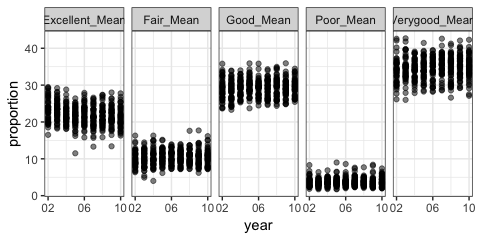
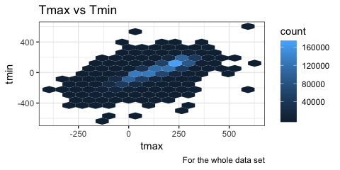

P8105\_hw3\_xz2809
================
Coco
10/4/2018

Problem 1
---------

This problem uses the BRFSS data. here is the **code chunks** for data cleaning and formatting.

``` r
data("brfss_smart2010")
brfss_smart2010=
  janitor::clean_names(brfss_smart2010) %>% 
  filter(topic=="Overall Health") %>% 
  select(-topic) %>% 
  select(-class) %>% 
  select(-question) %>% 
  select(-sample_size) %>%
  select(-(confidence_limit_low:geo_location)) %>% 
  spread(key = response, value = data_value) %>% 
  janitor::clean_names() %>% 
  mutate(states = locationabbr)
brfss_smart2010 <- brfss_smart2010[, c("year", "states","locationdesc","excellent","very_good","good","fair","poor")]
```

Here is the **code chunk** to do the analysis of BRFSS data.

``` r
num_state= brfss_smart2010 %>%
  filter(year == 2002) %>% 
  count(states) %>% 
  filter(n==7)

brfss_smart2010 %>% 
  group_by(year,states) %>% 
  count(states) %>% 
  ggplot(aes(x = year, y = n, color = states))+geom_line()+
  theme(legend.position = "none")
```


``` r
brfss_smart2010 %>% 
  filter(year==2002 | year==2006 | year==2010) %>% 
  filter(states =="NY") %>% 
  group_by(year,states) %>% 
  mutate (mean = mean(excellent),
          sd = sd(excellent)) %>% 
  filter(locationdesc == "NY - New York County") %>% 
  select(year,mean,sd) %>%
  knitr::kable(digits = 3)
```

    ## Adding missing grouping variables: `states`

| states |  year|    mean|     sd|
|:-------|-----:|-------:|------:|
| NY     |  2002|  24.040|  4.486|
| NY     |  2006|  22.533|  4.001|
| NY     |  2010|  22.700|  3.567|

``` r
brfss_smart2010 %>% 
  group_by(year,states) %>% 
  mutate(
    Excellent_Mean = mean(excellent),
    Verygood_Mean = mean(very_good),
    Good_Mean = mean(good),
    Fair_Mean = mean(fair),
    Poor_Mean = mean(poor)) %>% 
  select(year,states,Excellent_Mean:Poor_Mean) %>% 
  group_by(year) %>% 
  distinct(states,Excellent_Mean,Verygood_Mean,Good_Mean,Fair_Mean,Poor_Mean) %>% 
  gather(key = cat, value = proportion, Excellent_Mean:Poor_Mean) %>% 
  ggplot(aes(x = year, y = proportion)) +
  geom_point(alpha = .5) + 
  facet_grid(~cat) + 
  viridis::scale_fill_viridis(discrete = TRUE)+
  theme(legend.position = "none")+
  scale_x_continuous(breaks = c(2002, 2006, 2010), 
                     labels = c("02", "06", "10"))
```

    ## Warning: Removed 21 rows containing missing values (geom_point).



Problem 2
---------

This problem uses the Instacart data.

``` r
data("instacart")
```

How many aisles are there, and which aisles are the most items ordered from?

Make a plot that shows the number of items ordered in each aisle. Order aisles sensibly, and organize your plot so others can read it.

Make a table showing the most popular item aisles “baking ingredients”, “dog food care”, and “packaged vegetables fruits”

Make a table showing the mean hour of the day at which Pink Lady Apples and Coffee Ice Cream are ordered on each day of the week; format this table for human readers (i.e. produce a 2 x 7 table).

``` r
num_aisle = instacart %>% 
  count(aisle_id)  

which.max(num_aisle$n)
```

    ## [1] 83

``` r
x = instacart %>% 
  group_by(aisle_id) %>% 
  count(product_id) %>% 
  group_by(aisle_id) %>% 
  mutate(num_items = sum(n)) %>% 
  distinct(aisle_id,num_items)

ggplot(x, aes(x = aisle_id, y = num_items)) + geom_point()
```


Make a table showing the most popular item aisles “baking ingredients”, “dog food care”, and “packaged vegetables fruits”

``` r
y = instacart %>% 
  filter(aisle == "baking ingredients" | aisle == "dog food care" | aisle=="packaged vegetables fruits") %>% 
  mutate(aisle = as.factor(aisle)) %>% 
  group_by(aisle,product_id,product_name) %>% 
  count()

df_max <- aggregate(n ~ aisle, y, max) %>% 
  as.data.frame() 

df_max %>% 
  knitr::kable(digits = 1)
```

| aisle                      |     n|
|:---------------------------|-----:|
| baking ingredients         |   499|
| dog food care              |    30|
| packaged vegetables fruits |  9784|

Make a table showing the mean hour of the day at which Pink Lady Apples and Coffee Ice Cream are ordered on each day of the week; format this table for human readers (i.e. produce a 2 x 7 table).

``` r
z = instacart %>% 
  filter(product_name == "Pink Lady Apples" | product_name == "Coffee Ice Cream") %>% 
  select(order_hour_of_day,product_name,order_dow) %>% 
  group_by(product_name,order_dow) %>% 
  mutate(mean_hour_day = mean (order_hour_of_day)) %>% 
  distinct(product_name,mean_hour_day,order_dow) %>% 
  spread(key = order_dow, value = mean_hour_day) 

z %>% 
  knitr::kable(digits = 0)
```

| product\_name    |    0|    1|    2|    3|    4|    5|    6|
|:-----------------|----:|----:|----:|----:|----:|----:|----:|
| Coffee Ice Cream |   14|   14|   15|   15|   15|   12|   14|
| Pink Lady Apples |   13|   11|   12|   14|   12|   13|   12|

Problem3
--------

``` r
data("ny_noaa")
```

``` r
ny_noaa_df= ny_noaa %>% 
  separate(date, into = c("year","month","date"),sep = "-") %>% 
  janitor::clean_names() %>% 
  mutate(tmin = as.numeric(tmin),
         tmax = as.numeric(tmax),
         id = as.factor(id))
```

``` r
MaxTable <- function(x){
     m <- unique(x)
     m[which.max(tabulate(match(x,m)))]
}
MaxTable(ny_noaa_df$snow)
```

    ## [1] 0

Make a two-panel plot showing the average temperature in January and in July in each station across years. Is there any observable / interpretable structure? Any outliers?

``` r
mean_ave_df = ny_noaa_df %>% 
  mutate(year = as.numeric(year),
         month = as.factor(month)) %>% 
  filter(month=="07" | month == "01") %>% 
  group_by(year,month) %>% 
  filter(!is.na(tmax) & !is.na(tmin)) %>% 
  mutate(ave_max = mean(tmax)) %>% 
  distinct(year, month, ave_max) 
  
plot_names <- c("01" = "Januarary", "07" = "July")

mean_ave_df%>%
  ggplot(aes(x = year, y = ave_max)) + 
  geom_point(alpha = 0.5) +
  facet_grid(~month, labeller = as_labeller(plot_names))+
  viridis::scale_fill_viridis(discrete = TRUE)+
  theme(legend.position = "none")+
  scale_x_continuous(breaks = c(1981, 1990, 2000, 2010), 
                     labels = c("1981", "1990","2000","2010"))
```


``` r
mean_ave_df%>%
  ggplot(aes(y = ave_max)) + 
  geom_boxplot(alpha = 0.5) +
  facet_grid(~month, labeller = as_labeller(plot_names))+
  viridis::scale_fill_viridis(discrete = TRUE)+
  theme(legend.position = "none")
```


``` r
d <- ggplot(ny_noaa_df, aes(tmax,tmin))
d + geom_hex(bins = 15) + 
  theme(legend.position = "right")+
  ggtitle("Tmax vs Tmin")
```

    ## Warning: Removed 1136276 rows containing non-finite values (stat_binhex).



``` r
  labs(
    caption = "For the whole data set"
  )
```

    ## $caption
    ## [1] "For the whole data set"
    ## 
    ## attr(,"class")
    ## [1] "labels"
